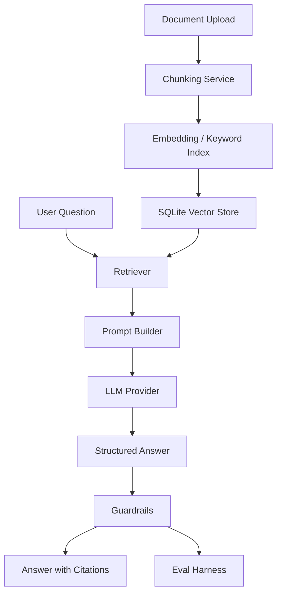

# InsightVault AI: RAG-Based Knowledge Intelligence API

**Author:** [https://github.com/piyushpradhan1996](https://github.com/piyushpradhan1996)

InsightVault AI is a backend-first LLM engineering portfolio project for ingesting documents, indexing knowledge, answering questions with source citations, extracting structured insights, and evaluating RAG behavior with repeatable test datasets.

The goal is not to build another chatbot. This project demonstrates the backend architecture behind a production-oriented RAG service: ingestion workflows, chunk metadata, local retrieval, provider abstraction, prompt templates, structured outputs, guardrails, async jobs, evals, API contracts, and CI-tested regression behavior.

## Why This Project Matters

LLM Engineer and AI Backend Engineer roles increasingly require more than prompt writing. Strong candidates need to show that they can build reliable systems around models:

- ingest and normalize messy knowledge sources
- retrieve relevant context with explainable metadata
- generate answers grounded in source chunks
- validate structured LLM output with schemas
- detect unsupported answers and missing citations
- run evals to measure regressions
- design APIs that other services or products can consume

InsightVault AI is built to show those skills in a focused, runnable MVP.

## Core Features

- Document ingestion from pasted text or `.txt`, `.md`, and `.json` uploads
- Configurable chunking with overlap and character offsets
- SQLite persistence for documents, chunks, embeddings, and async jobs
- Local hashed embedding provider by default, so no paid API key is required
- Explainable retrieval with score, chunk ID, document title, and citation label
- RAG question answering through `POST /api/ask`
- Source-grounded answers with citations and retrieved context returned to the client
- Structured insight extraction: summaries, action items, risks, decisions, entities, follow-up questions
- Prompt templates stored as versioned files
- Mock LLM provider by default with optional OpenAI provider support
- FastAPI BackgroundTasks for async ingestion job status
- Guardrails for missing context, missing citations, weak grounding, duplicate citations, and insight schema validation
- Evaluation harness with sample refund policy, meeting notes, API docs, and incident report datasets
- Markdown summary export
- Pytest coverage and GitHub Actions CI

## Tech Stack

- Backend: Python, FastAPI
- Database: SQLite for MVP
- Retrieval: local hashed embeddings plus cosine similarity
- LLM providers: Mock provider by default, optional OpenAI provider
- Validation: Pydantic
- Async jobs: FastAPI BackgroundTasks
- Testing: Pytest, FastAPI TestClient
- CI/CD: GitHub Actions

## Backend Architecture

```text
backend/app
  main.py                  FastAPI routes and workflow orchestration
  config.py                Environment-driven settings
  database.py              SQLAlchemy engine/session setup
  models.py                SQLAlchemy persistence models
  schemas.py               Pydantic request/response contracts
  prompts/                 Versioned prompt templates
  services/
    chunking_service.py    Text chunking with offsets and overlap
    document_service.py    Document persistence and chunk indexing
    embedding_provider.py  Local/OpenAI embedding provider abstraction
    retrieval_service.py   Top-k chunk retrieval
    llm_provider.py        LLM provider interface and selection
    mock_llm_provider.py   Deterministic local provider
    openai_provider.py     Optional OpenAI provider
    guardrail_service.py   Citation and grounding checks
    eval_service.py        RAG evaluation runner
    markdown_export.py     Markdown summary rendering
```

## RAG Architecture



## Document Ingestion Flow

1. Client submits title, content, source type, and optional tags.
2. Backend stores the original document metadata.
3. Chunking service splits content using configurable chunk size and overlap.
4. Each chunk receives metadata:
   - `document_id`
   - `chunk_id`
   - `title`
   - `source_type`
   - `tags`
   - `character_start`
   - `character_end`
5. Local embedding provider creates deterministic hashed vectors.
6. Chunks and embeddings are stored in SQLite.
7. API returns document ID, ingestion status, and chunk count.

## Chunking And Retrieval

The MVP uses a deterministic local embedding provider implemented as a hashed bag-of-words vector. This avoids paid APIs while still demonstrating the retrieval pipeline:

- query text is embedded
- stored chunk embeddings are loaded
- cosine similarity scores are calculated
- top-k chunks are returned with citation labels

This is intentionally explainable and testable. ChromaDB, FAISS, hybrid BM25/vector retrieval, and reranking are listed as future improvements.

## LLM Provider Abstraction

The backend uses a provider interface:

- `BaseLLMProvider`
- `MockLLMProvider`
- `OpenAIProvider`

Default behavior:

```text
AI_PROVIDER=mock
```

OpenAI behavior:

```text
AI_PROVIDER=openai
OPENAI_API_KEY=your_key_here
```

If OpenAI configuration is missing, the app falls back to mock mode. The project never requires a paid API key to run locally or pass tests.

## Structured Outputs

Insight extraction returns a strict Pydantic-validated schema:

```json
{
  "summary": "string",
  "action_items": [
    {
      "task": "string",
      "owner": "string or unknown",
      "deadline": "string or unknown"
    }
  ],
  "risks": [],
  "decisions": [],
  "entities": [],
  "follow_up_questions": [],
  "model_metadata": {},
  "guardrail_result": {}
}
```

## Citation Grounding

Every RAG answer returns:

- answer text
- citations
- retrieved context
- model metadata
- guardrail result

If no context is found, the answer refuses with:

```text
I could not find enough information in the uploaded documents.
```

## Guardrails

The guardrail layer checks:

- no retrieved context means the answer must refuse
- grounded answers must include citations
- duplicate citations are removed
- weak keyword support is flagged as a warning
- structured insights must pass schema validation
- empty insight summaries fail validation

Example guardrail response:

```json
{
  "passed": true,
  "warnings": [],
  "errors": []
}
```

## Evaluation Harness

Eval fixtures live in `backend/evals/`:

- `refund_policy_eval.json`
- `meeting_notes_eval.json`
- `api_docs_eval.json`
- `incident_report_eval.json`

Each eval ingests sample documents, asks test questions, and scores:

- retrieval hit
- answer contains expected terms
- citation present
- unsupported answer detected
- percentage score

Run evals through the API:

```bash
curl -X POST http://localhost:8000/api/evals/run
```

## Async Job Handling

`POST /api/documents/async` creates a queued ingestion job and processes it with FastAPI BackgroundTasks.

Statuses:

- `queued`
- `processing`
- `completed`
- `failed`

Check status:

```bash
curl http://localhost:8000/api/jobs/{job_id}
```

## API Endpoints

| Method | Endpoint | Purpose |
| --- | --- | --- |
| `GET` | `/health` | App health and active LLM provider |
| `POST` | `/api/documents` | Ingest pasted document content |
| `POST` | `/api/documents/file` | Upload `.txt`, `.md`, or `.json` document |
| `POST` | `/api/documents/async` | Queue async ingestion job |
| `GET` | `/api/jobs/{job_id}` | Check ingestion job status |
| `GET` | `/api/documents` | List ingested documents |
| `GET` | `/api/documents/{document_id}` | Get document metadata and preview |
| `POST` | `/api/retrieve` | Retrieve relevant chunks |
| `POST` | `/api/ask` | Ask a RAG-grounded question |
| `POST` | `/api/insights` | Extract structured insights |
| `GET` | `/api/documents/{document_id}/summary.md` | Export Markdown document summary |
| `POST` | `/api/evals/run` | Run RAG eval fixtures |

FastAPI Swagger docs are available at:

```text
http://localhost:8000/docs
```

## Setup

```bash
cd insightvault-ai/backend
python -m venv .venv
.\.venv\Scripts\activate
pip install -r requirements.txt
copy ..\.env.example .env
```

On macOS/Linux:

```bash
cd insightvault-ai/backend
python -m venv .venv
source .venv/bin/activate
pip install -r requirements.txt
cp ../.env.example .env
```

## Run Backend

```bash
cd insightvault-ai/backend
uvicorn app.main:app --reload
```

Open:

```text
http://localhost:8000/docs
```

## Run Tests

```bash
cd insightvault-ai/backend
pytest
```

## Run Evals

With the API running:

```bash
curl -X POST http://localhost:8000/api/evals/run
```

Or use Swagger:

```text
POST /api/evals/run
```

## Example Requests

### Ingest Document

```bash
curl -X POST http://localhost:8000/api/documents \
  -H "Content-Type: application/json" \
  -d "{
    \"title\": \"Refund Policy\",
    \"source_type\": \"policy\",
    \"tags\": [\"support\", \"billing\"],
    \"content\": \"Customers can request a refund within 30 days of purchase. Refunds are not available for final sale items.\"
  }"
```

Example response:

```json
{
  "document_id": 1,
  "title": "Refund Policy",
  "ingestion_status": "completed",
  "chunk_count": 1
}
```

### Retrieve Chunks

```bash
curl -X POST http://localhost:8000/api/retrieve \
  -H "Content-Type: application/json" \
  -d "{
    \"query\": \"What is the refund window?\",
    \"top_k\": 5
  }"
```

Example response:

```json
{
  "query": "What is the refund window?",
  "results": [
    {
      "chunk_id": "doc-1-chunk-1",
      "document_title": "Refund Policy",
      "score": 0.65,
      "text": "Customers can request a refund within 30 days of purchase.",
      "citation": "[Refund Policy, chunk 1]"
    }
  ]
}
```

### Ask A Grounded Question

```bash
curl -X POST http://localhost:8000/api/ask \
  -H "Content-Type: application/json" \
  -d "{
    \"question\": \"What is the refund window?\",
    \"top_k\": 5,
    \"answer_style\": \"concise\"
  }"
```

Example response:

```json
{
  "answer": "Based on the uploaded documents, Customers can request a refund within 30 days of purchase. [Refund Policy, chunk 1]",
  "citations": [
    {
      "citation": "[Refund Policy, chunk 1]",
      "document_title": "Refund Policy",
      "chunk_id": "doc-1-chunk-1"
    }
  ],
  "retrieved_context": [
    {
      "chunk_id": "doc-1-chunk-1",
      "document_title": "Refund Policy",
      "score": 0.65,
      "text": "Customers can request a refund within 30 days of purchase.",
      "citation": "[Refund Policy, chunk 1]"
    }
  ],
  "model_metadata": {
    "provider": "mock",
    "used_rag": true,
    "top_k": 5,
    "prompt_version": "rag_qa_v1",
    "embedding_provider": "local"
  },
  "guardrail_result": {
    "passed": true,
    "warnings": [],
    "errors": []
  }
}
```

## Screenshots

Screenshots can be added after running the API locally:

- Swagger API docs
- `/api/ask` response with citations
- `/api/evals/run` output
- Markdown summary export

## Future Improvements

- PostgreSQL migration for production persistence
- ChromaDB or FAISS vector store
- PDF parsing and OCR ingestion
- Hybrid BM25 plus vector retrieval
- Cross-encoder reranking
- Streaming answer endpoint
- User authentication and workspace-level document isolation
- Celery plus Redis for production-grade job queues
- OpenTelemetry tracing for retrieval and LLM calls
- More advanced groundedness and citation eval metrics
- Minimal React admin UI for demos
